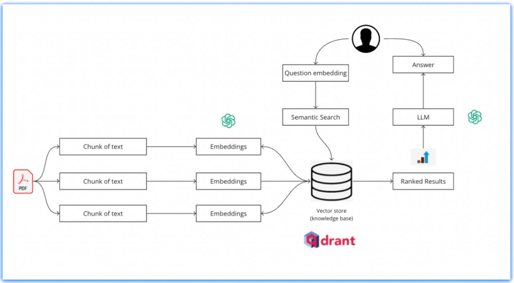

# Legal Research Assistant

AI-powered legal research assistant using RAG (Retrieval Augmented Generation) pipeline.



## Installation

1. Clone the repository:
```bash
git clone https://github.com/Prakhar29Sharma/nyai-saathi-server.git
cd nyai_saathi_server
```

2. Run the setup script:
    ```bash
    ./setup.sh
    ```

3. Add your `GOOGLE_API_KEY` and `HUGGINGFACE_TOKEN` to the `.env` file created in the `app` directory.

## Environment Variables

The following environment variables are used in the project and should be set in the `.env` file:
- `GOOGLE_API_KEY`
- `HUGGINGFACE_TOKEN`
- `QDRANT_HOST` (default: `localhost`)
- `QDRANT_PORT` (default: `6333`)
- `COLLECTION_NAME` (default: `legal_documents`)
- `VECTOR_SIZE` (default: `384`)
- `EMBEDDING_MODEL` (default: `sentence-transformers/all-MiniLM-L6-v2`)

## Docker Setup

### Prerequisites
- Docker
- Docker Compose

### Setting up Qdrant Container

1. Pull and run Qdrant container:
```bash
docker-compose up
```

## Running the Server

To run the FastAPI server, use the following command:
```bash
fastapi dev main.py
```

## Running Tests

To run the tests, use the following command:
```bash
pytest -v
```

## License

This project is licensed under the MIT License.